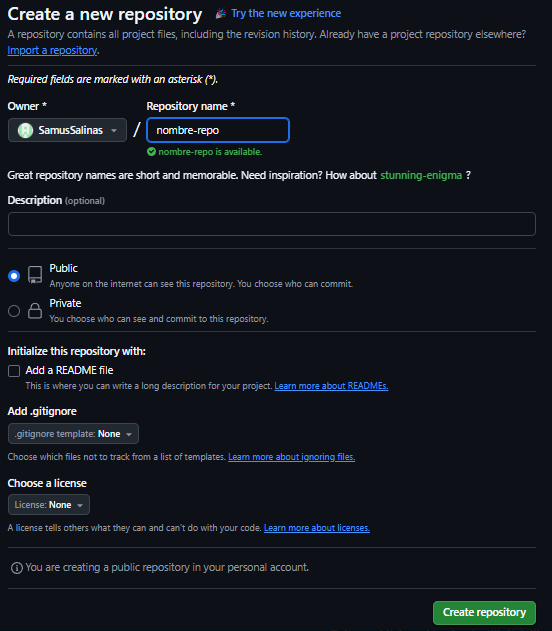

# Clase 03

## Crear repositorio en Github



## Si el repositorio no esta creado

…or create a new repository on the command line

``` sh
echo "# nombre-repo" >> README.md
git init
git add README.md
git commit -m "first commit"
git branch -M main
git remote add origin https://github.com/SamusSalinas/nombre-repo.git
git push -u origin main
```
## Si el repo esta creado

…or push an existing repository from the command line

``` sh
git remote add origin https://github.com/SamusSalinas/nombre-repo.git
git branch -M main
git push -u origin main
```

## GIT REMOTE 

``` sh
git remote
```

>Mas detalle sobre los remotos 

``` sh
git remote -v
```

> Para agregar un remoto 

``` sh
git remote add <alias> <url-del-remoto>
```

> Para quitar un remoto 

``` sh
git remote remove <alias>
git remote remove origin
```

## Si quiero subir al repositorio remoto el local 

>La primera vez

``` sh
git push -u <alias-del-remoto> <rama-local-que-quiero-subir>
git push -u origin main
```

> Las sigiuentes veces que quiera subir

``` sh
git push 
```

## Resolver conflicto 
Cuando hay una diferencia entre la historia (los hashes) del local con los del remoto


``` sh
git push -f # fuerza la subida de lo que esta en el repo local 
```
## GIT ignore
Me permite ignorar archivos que no quiero que pertenezcan al repositorio 

## GITKEEP
Lo creo la comunidad para incluir los repositorios de las carpetas vacias

## GIT ADD INTERACTIVO (CONTINUACION)
``` sh
git add -i
```